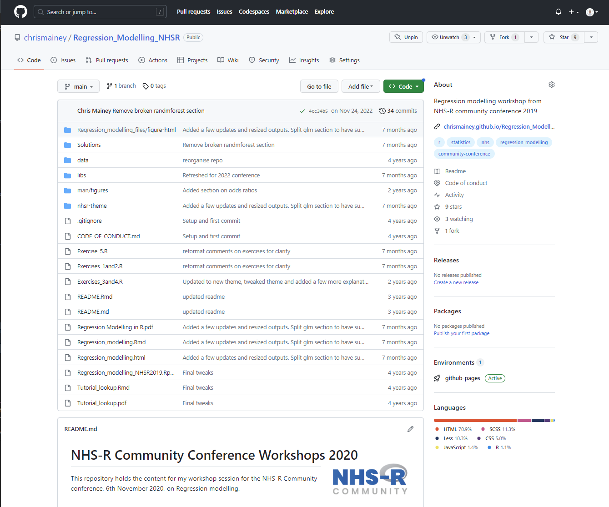
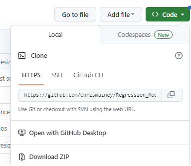
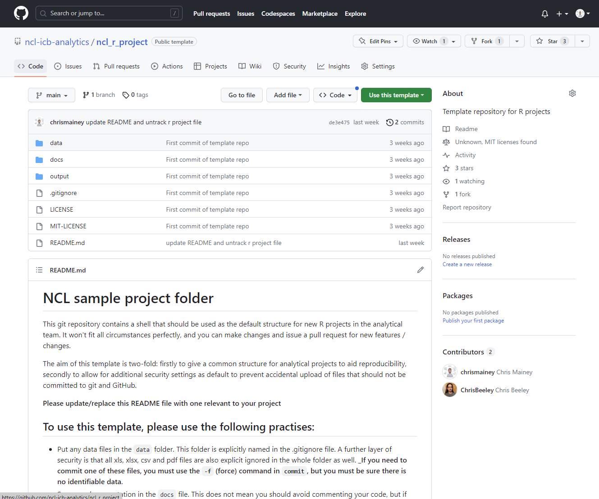

```{r libs, message=FALSE, warning=FALSE, include=FALSE}
library(knitr)
library(tidyverse)
library(xaringan)
library(magick)
library(xaringanExtra)

xaringanExtra::use_share_again() # need to get the slide button on html view

opts_chunk$set(
  echo = TRUE,
  eval = FALSE,
  message = FALSE,
  warning = FALSE,
  fig.width = 7.252,
  fig.height = 4,
  dpi = 300,
  dev.args = list(type = "cairo")
)

```

class: title-slide, left

# `r rmarkdown::metadata$title`


### `r rmarkdown::metadata$author`
### `r rmarkdown::metadata$date`
Artwork by @allison_horst".
---

## Managing your files

Is this familiar?

.pull-left[
<br>
>file_v1.0.doc

>file_v1.1.doc

>file_v1.0.1.doc

>file_final_1.0.doc

>file_final_final.doc
]

.pull-right[


Sourced from [xkcd](https://xkcd.com/1459/)
]
---

# Source control

Tracked-changes, but for code (well...any files really, but works best on code and text)

.pull-left[

+ Helps you manage your work

+ Gives you the ability to set 'anchors' that keep you from falling

+ Allows others to follow the same route

+ Code can be shared!


]

.pull-right[


Artwork by @allison_horst

]

---

## Why should I share it / publish it?

.pull-left[
### Data saves lives: reshaping health and social care with data (2022)

>Public services are built with public money, and so the code they are based on should be made available across the health and care system, and those working with it, to reuse and build on.

>Analysts and developers should be encouraged to think from the start of a project about how work can be shared or consider ‘coding in the open’ – for example, through the use of open notebook science. This will include sharing technical skills and domain knowledge through sites like Cross Validated and Stack Overflow, while sharing code and methodology through platforms like GitHub will build high-quality analytics throughout the system.

]
.pull-right[
### The Government Digital service manual states:

>For any service to be put in front of the public, it has to meet the Digital Service Standard, a set of 18 criteria.

>One of the criteria is that all new source code is made open and published under an open source licence.

>This goes hand in hand with our tenth design principle: make things open: it makes things better.

https://gds.blog.gov.uk/2017/09/04/the-benefits-of-coding-in-the-open/
]


---

# How do you get started?

+ Get Git for windows installed on the machine you are working on!

+ Learn basics:
 + `git init`
 + `git add`
 + `git commit`

 
+ Learn about using a `remote` like 'GitHub' www.github.com, and set them up
 + `git remote`
 + `git push`
 + `git pull`
 

+ Learn about git / github workflows
 + Various ones to suit different processes (see documentation after session)

---

# More Advanced elements

+ Creating 'branches' of code is a useful for multiple users, or new features:
 + `git branch`

+ To bring branches (and work by multiple people) together, you need to 'merge' it
  + `git merge`
  + Merging usually works fine, but where it doesn't it creates a CONFLICT, and marks it for you to resolve.
  + Leaves both copies, and markers, for you to choose from
  + Then add and commit once resolved.

+ Rebasing is a way to squash multiple commits together into a single commit, useful for merging in a new element
 + `git rebase`
 
+ Reset allows you to move backwards and forwards to different commits
 + `git reset`

---

# Basics

+ commands below can be entered at command prompt (CMD, 'terminal', Powershell, bash and others)

## Initialise
Git works by tracking a folder.  To do this, you need to first __initialise__ a git repository in that folder, e.g.

```{bash gitint}
git init
```

You will see a hidden '.git' folder that tracks changes is now created.

---

## Tracking files

Few names for the same thing:  "staging", "tracking", "adding files", "checking-in". All mean Git is watching it.

To add a file named 'myfile.txt', we would enter:
```{bash gitadd1}
git add myfile.txt
```

To add all untracked changes/files all changes in the the folder:
```{bash gitadd2}
git add --a
# or 
git add -all
```

__Beware with adding all, as you must check there are no data files or things you don't want committed.__
<br>
__One solutions is a .gitignore file, which we will use in NCL template.__

---

# Commits

+ Now we can snapshot the files we've added using a `commits`
+ You should give each commit a descriptive message using the -m command.

```{bash commit1}
git commit -m "My commit message, explaining what I'm commiting"
```

--

+ Each commit has a unique code that you can use to refer to it in future.

```{bash log, collapse=TRUE}
# To open logs
git log

# to quit the viewer of the log file
q
```
 


+ We won't go into rolling backwards or forwards today, or merging or conflicts, but these are important elements if you want to learn to use it.
+ Normal to get things wrong and Google a lot!

---

# Remotes

.pull-left[
+ Now you've tracked your changes locally, you are fine, but how does that work for other people?

+ Need to synchronise our folder history with a 'remote' that is accessible to anyone working on it:
  + Can be a shared folder
  + Private or public Git services like Azure DevOps (TFS), GitLab & GitHub

{{content}}
]

.pull-right[


Artwork by @allison_horst

]

--

+ We first need to add the remote and give it a name.  This is usually `origin` if only one remote.

--

+ We then need to tell our project to track it, and that our main branch is the same are the remote's branch ('upstream')


---

# GitHub as a remote

+ GitHub is the most well-known of the Git services.  It has substantial free options, and additional paid options.
+ Online, and standard format.




---

# GitHub essentials

+ Create and account, recommend 2-factor authentication (and required to use the NCL_analytics GitHub)
+ Recommend setting up a Personal Access Token (will show online), as Git will ask for it when you first commit

--

## Workflow

A lot of possible workflows with GitHub, but couple of relevant steps as a new user:
1. Start on machine, create blank github repository and add it as a remote
2. Start on github, create a repository and clone it you machine to work on.  __Recommended with NCL template__


.footnote[This details on the Atlassian page here are useful for [Comparing Workflows](https://www.atlassian.com/git/tutorials/comparing-workflows).]


---

# Remote commands (1)

To check what `remote`s you have connected to your local repository you can use the `--verbose` or `-v` commands:
```{bash remotev}
git remote -v
```

--

To add a remote
```{bash remote, linewidth=60}
# replace 'remote-url' with the corresponding url (or file path)
git remote add name remote-url 

# e.g. to add the remote repository on GitHub
# https:
git remote add origin https://github.com/chrismainey/Regression_Modelling_NHSR.git

```

--

To set the 'upstream' to the corresponding name:
```{bash upstream, linewidth=60}
git push --set-upstream origin main
```

---

# Remote commands (2)

.pull-left[
<br><br>
To clone a repository from GitHub, go to the green button and copy the link: 

<br><br>

Then, in the folder you want it to download to, use the command with your url:

]

.pull-right[

]

```{bash clone}
git clone "url"

#e.g.
git clone "https://github.com/ncl-icb-analytics/MSK_risk_factors_regression.git"
```


---

# Remote commands (3)

### Adding your code to a repository / updating

To send our code to a remote, we use the `git push` command.  
```{bash gitpush}
# To default remote `origin`, on the branch you are currently on (with upstream set)
git push

# To push to somewhere other than the default we name the remote (and the branch if differing from current branch)
# E.g. to push to a remote called `external`
git push external

# To push another branch called `publish` on the `external` remote, we name it
git push external publish
```

---

# Remote commands (4)

### Getting code from a repository


If we want to get the changes from the origin, there are two options:

+ `fetch` that updates the history of the repository without pulling the files
+ `pull` that updates the history of the repository and pulls the files

```{bash gitpull}
# to pull from default remote `origin`, on the branch you are currently on (with upstream set)
git pull

# To pull from somewhere other than the default we name the remote (and the branch if differing 
# from current branch without upstream set).  E.g. to pull from a remote called `external`
git pull external main
```
---

# Security and IG

___A word on security and IG.:___

+ It's common to be concerned about publishing patient data, or credential here.

+ If you publish patient data, or other sensitive data to GitHub, it's the same as any other IG breach!

--

### How do we work with these constrains?

+ Use Git / GitHub for code, __NOT DATA!__

--

+ Never script your credentials

--

+ use tools to help:
  + `.gitignore` file
  + Tools such as `precommit` python library
  + Put credentials in 'environmental variables' or encrypted keystores, or better still don't script them.
  + Use a template with these standards as a starting point: e.g. NCL template or Government Data Science Cookie Cutter.
  

---
# NCL GitHub organsiation

+ To manager our organisations projects, I've set up a 'GitHub Organisation'.  Several administrators/owners, but come to me with queries.

.pull-left[
+ Set up a template repository:
  + __Data folder:__ put data files here
  + __Outputs:__ Put outputs, be they tables, reports, figures etc. here
  + __.gitignore:__  Set to automatically ignore Data & Outputs folders, as well as .csv, .xls, .xslsx, .doc,.docx, .pdf files
  + __README.md files__: Plain text Readme files in 'markdown' format.  Use this to describe your project.
  + __Licencing:__ you can't use code without a licence, even if it's in the public.  As NHS, we need to use Open Government license, plus recommended MIT licence.
]

.pull-right[


]

---

# Using GitHub at NCL

+ Will run more in-depth sessions with users wanting more knowledge and to start using it.

+ __Please use the template!__:
  + At the start of a project, first create a new GitHub repository, using the template
  + Give it a name and a description
  + Then `clone` it to you machine as your starting folder.
  + Update the README.md file(s)
  
+ Let me know if you need more templates, or changes are needed (or, ideally, use your new Git skills to make the changes and we can merge them).

+ If in doubt, ask for help.  Happy to help.

+ It's normal to get things wrong.  Don't worry about what the commit history, or your code looks like.

+ __Be double sure, particularly when learning, that you are not committing data or credentials__

---

# Summary

+ Git is source-control software, like 'track-changes' for your code or other files

+ Works standalone on your machine, but really value is with a 'remote' were you can share and collaborate

+ Not everything we do is ready for this sort of publishing yet.  Particular problem with Excel files (embedded data in them).

+ GitHub is the most popular of the `remote` provider services and can be used free.

+ We have an NCL GitHub organisation, let me know your username and I'll make you part of the organisation

+ NCL template has been thought out to help prevent accidental publishing of data files. __Please use it!__

+ To use it, create a new repository on GitHub based on the template, then clone it to ou machine before starting work.

+ Don't worry about making mistakes, have a try and see, even if it's just on your machine.